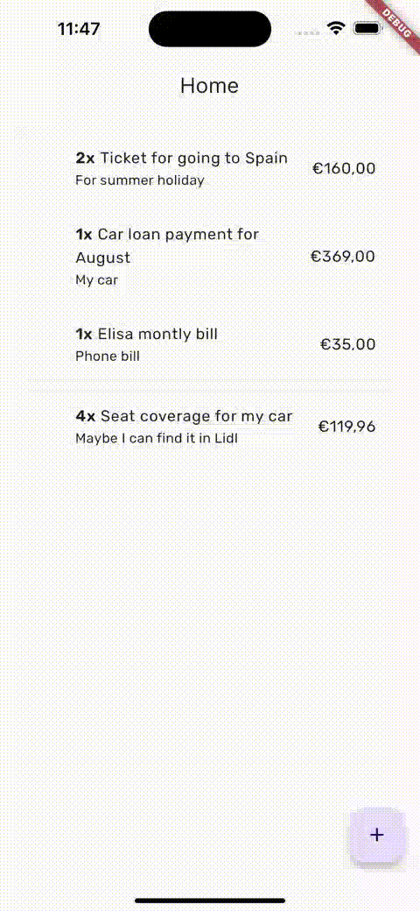

# Simple shopping list app with flutter

## Application goal
This app allows you that adding the items that you need to buy

-> You can create new item that you need to buy by clicking add button in right bottom corner

-> You can activate multiple deletion by long pressing the items.

-> You can mark that you have purchased that product by single clicking on the item

## Compiling & Running

You will need the Flutter structure and the <a href="https://docs.flutter.dev/get-started/install">basics it needs</a>, the app supports both Android and iOS

## Structures used for development:

<ul>
    <li><a href="https://firebase.google.com/docs/reference/rest/database?hl=en">Firebase Realtime Database REST API</a></li>
    <li><a href="https://pub.dev/packages/mobx">MobX</a> for state management</li>
    <li><a href="https://pub.dev/packages/auto_route">auto_route</a> for navigation</li>
    <li><a href="https://pub.dev/packages/get_it">get_it</a> for service locator</li>
    <li><a href="https://pub.dev/packages/dio">Dio</a> for rest api calls</li>
    <li><a href="https://pub.dev/packages/json_serializable">json_serializable</a> and <a href="https://pub.dev/packages/json_annotation">json_annotation</a> for model serializations</li>
    <li><a href="https://pub.dev/packages/flutter_native_splash">flutter_native_splash</a> for setup native splash</li>
    <li><a href="https://pub.dev/packages/mockito">mockito</a> for testing</li>
    <li><a href="https://pub.dev/packages/easy_localization">easy_localization</a> for localization</li>
</ul>

## Folder structure
    ├── lib
    │   ├── app                 // Material App     
    │   ├── common              // Common things such as widgets, extensions, etc.
    │   ├── core                // App core
    │   │   ├── api             // Http service  
    │   │   ├── di              // Service loactor
    │   │   ├── exceptions      // Handled exceptions
    │   │   └── route           // Navigation
    │   ├── data
    │   │   ├── datasources     // Datasources /remote, local, etc.
    │   │   ├── models          // Models
    │   │   └── repositories    // Repositories (impl)
    │   ├── domain  
    │   │   ├── entities        // Entities 
    │   │   ├── mappers         // Model and entity mappers
    │   │   ├── repositories    // Repositories (interface)
    │   └── ui                  // Pages and mobx controllers
    │       └── ...
    └── ...

### Json serialization
You need to run `dart run build_runner build --delete-conflicting-outputs` whenever you change model structures

### Testing
Testing coverage is not 100% currently, but most important parts are done,
 
You can run `flutter test --coverage && genhtml coverage/lcov.info --output coverage/html/ && open coverage/html/index.html` in order to see testing coverage results

<b>PS:</b> You might need to install `lcov` to your computer if you don't already have
